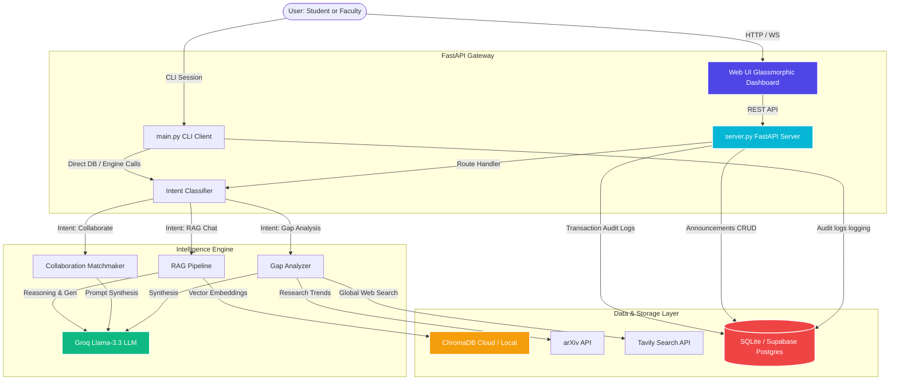

# 🎓 Faculty Research Intelligence Platform (FRIP)

[]()
[]()
[]()
[]()
[]()

The **Faculty Research Intelligence Platform (FRIP)** is a production-grade enterprise academic RAG search, peer-matching, research gap identification, and targeted announcements broadcasting portal. It is designed to assist Vardhaman University administrators, faculty members, and students by utilizing artificial intelligence and natural language processing to classification-route user intent, crawl global research indices, identify institutional gaps, and target university communications.

---

## ⚙️ Enterprise System Architecture

The following diagram illustrates the flow of queries and communications from frontends down through the cognitive classification routing, external search agents, vector databases, and relational backends.



---

## ✨ Core Capabilities

### 🔍 Cognitive RAG Chat Search
- Classifies incoming queries via a multi-intent classifier router.
- Employs contextual chunk retrieval from **ChromaDB** with dynamic page citation mapping.
- Automatically falls back to external APIs (**arXiv** + **Tavily Web Search**) when local information density is low.

### 🤝 Synergy peer-matchmaking
- Synthesizes collaborative joint project proposals between professors based on shared interests and workload indexes.
- Prevents resource overallocation by monitoring real-time faculty availability metrics.

### 🔬 Global Trend Gap Analysis
- Connects to web-scale databases to cross-reference global research milestones against internal university competency maps.
- Exposes unexplored domains and proposes actionable directions for new studies.

### 📢 Targeted Announcements Broadcasting
- Enables immediate publication or saving as draft.
- Supports fine-grained target audience segmentation (e.g. *All*, or specifically targeted to a *Department*, *Year*, or *Section*).
- Highlighted unread alerts, dynamic counts, and localized profile preference storage.
- Premium glassmorphic slide-out side panel for creation, edits, file attachments, and deletes.

---

## 🛠️ Installation & Verification

### Prerequisites
- Python 3.9 - 3.11
- Pip package manager

### 1. Configure Environmental Settings
Create a `.env` file in the root workspace directory from the `.env.example` template:

| Variable | Description | Default / Example |
| :--- | :--- | :--- |
| `CHROMA_MODE` | Chroma location configuration | `remote` |
| `CHROMA_HOST` | Chroma Cloud API endpoint | `api.trychroma.com` |
| `CHROMA_PORT` | Chroma Port | `443` |
| `CHROMA_SSL` | Secure connection flag | `true` |
| `CHROMA_API_KEY` | Chroma DB authentication token | `your_chromadb_cloud_key` |
| `CHROMA_COLLECTION_NAME` | Main paper vector index collection | `Researchpapers` |
| `GROQ_API_KEY` | Groq Developer API token | `your_groq_api_key` |
| `GROQ_MODEL` | Reasoning Model variant | `llama-3.3-70b-versatile` |
| `TAVILY_API_KEY` | Optional Web Search integration token | `your_tavily_key` |

### 2. Dependency Installation
Initialize your virtual environment and run the installer:
```bash
python -m venv .venv
.venv\Scripts\activate
pip install -r requirements.txt
```

### 3. Database Initialization & Schema Migration
To setup the relational tables and apply migrations:
```bash
python -m db.init_db
```

---

## 🚀 Running the Platform

### A. Start the Backend API Server & UI
Launch the FastAPI development environment:
```bash
python server.py
```
* The API endpoints will start listening at: [http://localhost:8000/api](http://localhost:8000/api)
* The polished Web Dashboard will be served at: [http://localhost:8000/dashboard.html](http://localhost:8000/dashboard.html)

### B. Launch Terminal CLI Session
For text-only interactions, run the command-line client:
```bash
python main.py
```

---

## 📡 REST API Reference

| Endpoint | Method | Description | Payload Schema |
| :--- | :---: | :--- | :--- |
| `/api/chat` | `POST` | Dynamic RAG chat with classification | `{"query": str, "role": str}` |
| `/api/recommend` | `POST` | Get closest faculty profile matches | `{"query": str}` |
| `/api/collaborate` | `POST` | Propose joint peer-to-peer synergy projects | `{"faculty_a": str, "faculty_b": str}` |
| `/api/professor-mode` | `POST` | Institutional research gap analysis | `{"topic": str}` |
| `/api/upload_pdf` | `POST` | Clean, chunk, and index profile PDF | `Multipart Form File` |
| `/api/announcements` | `POST` | Create announcement draft / publication | `AnnouncementCreate` |
| `/api/announcements` | `GET` | Retrieve targeted announcements | *(Query Params)* `role`, `department`, `year`, `section` |
| `/api/announcements/{id}` | `PUT` | Update/Edit an existing announcement | `AnnouncementCreate` |
| `/api/announcements/{id}` | `DELETE`| Delete an announcement | None |
| `/api/announcements/upload_attachment` | `POST` | Save file attachments | `Multipart Form File` |

---

## 🏢 Enterprise Compliance & Governance
- **Data Protection**: Local SQLite database storage incorporates automated schema rollbacks to ensure transactions satisfy ACID constraints.
- **Vercel Serverless Ready**: Layout complies with stateless handler constraints for instant horizontal scale deployments.
- **License**: Distributed under the MIT Open Source License.
